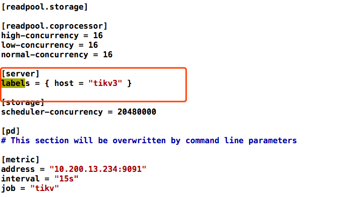
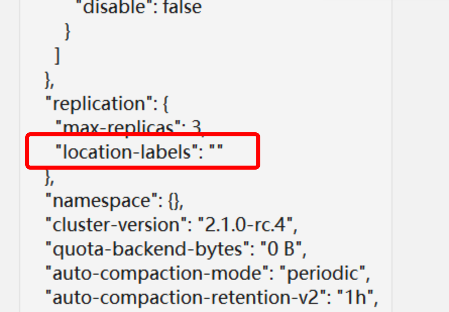

## 现象
三台物理机，每个物理机两个 TiKV 实例，其中一台物理机因硬件故障在 2 月 11 日凌晨 3 点 16 分宕机，出现服务不可用

## 环境信息收集
### 版本

2.1 rc

### 部署情况

 - tidb-ansible 部署方式部署，三台物理机，每台物理机两个 TiKV 实例
 - 用户说 TiKV cluster 与 PD 均已配置 label

## 分析步骤

- 单台物理机部署多台 TiKV，一台物理机宕机导致服务不可用，怀疑 label 配置有问题
- 检查 tidb-ansbile 的 inventory.ini 文件的配置，发现 TiKV 的 label 是正确配置了

- 检查宕机那台机器上的 TiKV 配置，看由 ansbile 生成的 tikv.toml 是否带了 label，发现没有问题

- 通过 pd-ctl 工具执行 show config 命令看 PD 的 location-labels 是否配置正确，发现没有配置

## 结论
- 虽然 TiKV 正确配置了 label，但是 PD 没有配置对应的 location-labels，导致 label 没有起到应有的作用。
- 正确的 label 配置方式请参考[单物理机部署多 TiKV 实例](https://pingcap.com/docs-cn/stable/how-to/deploy/orchestrated/ansible/#%E5%8D%95%E6%9C%BA%E5%A4%9A-tikv-%E5%AE%9E%E4%BE%8B%E9%9B%86%E7%BE%A4%E6%8B%93%E6%89%91)

