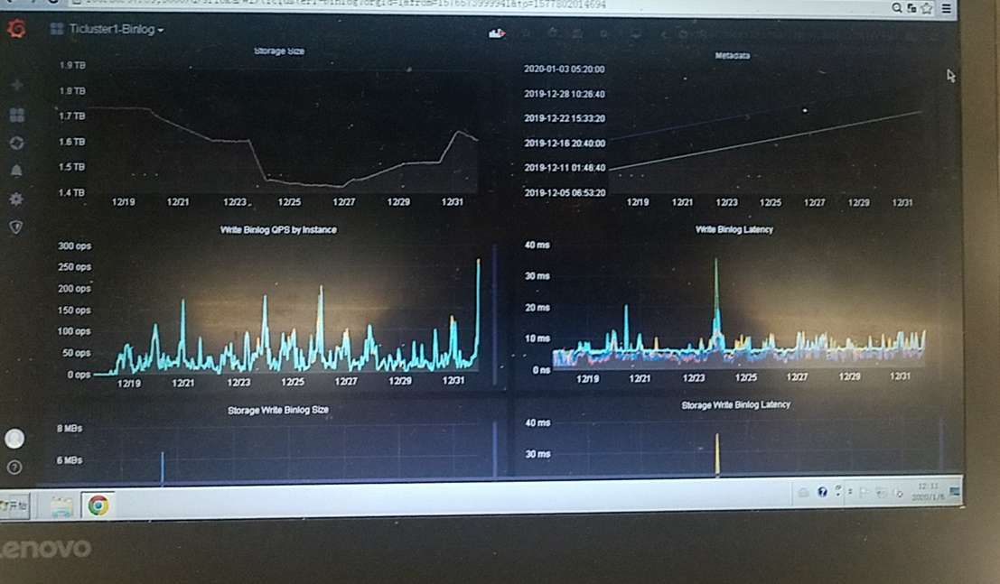
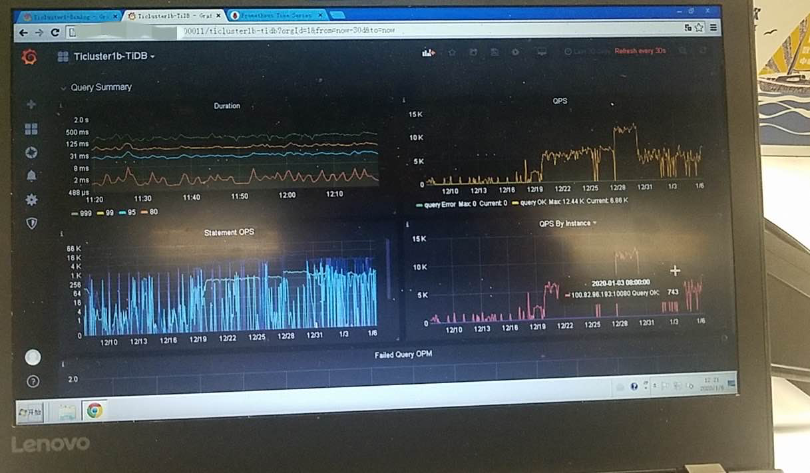
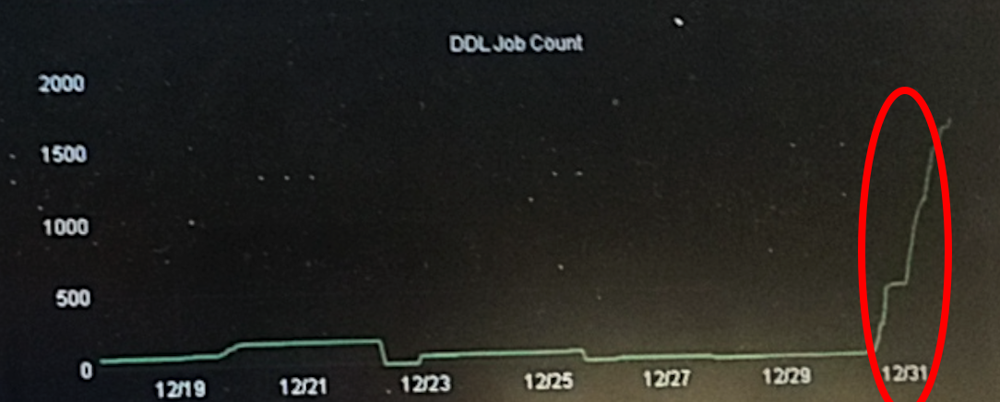
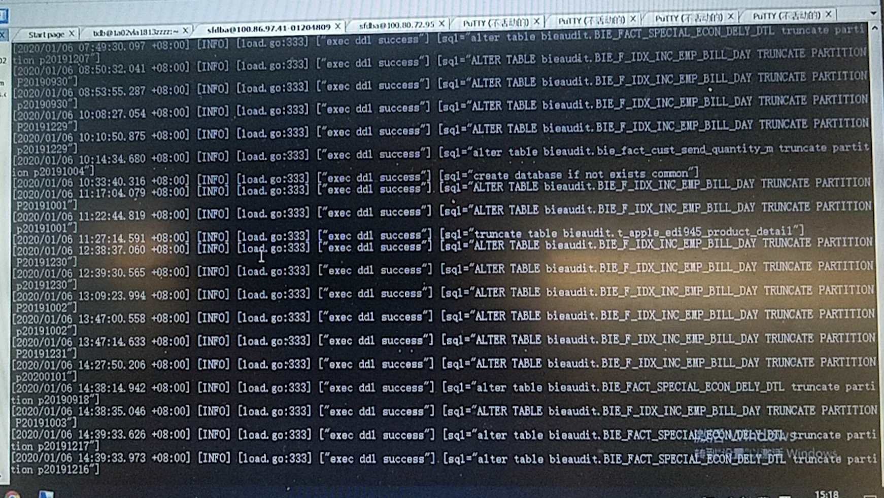

## 现象
* 升级 drainer 之后，到下游 TiDB 的同步慢，调整 drainer batch，效果并不明显

## 问题分析
* 已知信息

> 26号凌晨上游集群 TiDB v3.0.1 升级 v3.0.5，27 号手工替换 drainer 升级，用户反馈同步慢

> 调整 drainer batch 、并发时间大概是2019年12月27 号下午，看效果并不明显,下游集群看起来 duration 并不高 ,目前 duration .999 250ms 左右，6-8K，刚开始调整完可到10k-11k，后面回落至 6-8K

* 分析步骤

>查看监控项，在 12 月 31 号开始出现比平时多的 DDL，对于 Drainer 来说频繁的 DDL 操作会导致 DML 没法按指定的 batch size 批量执行，影响下游写入影响性能

> DDL 绝大部分来自某个 database 下的几张表，在做一些 truncate table / truncate partition 的操作，集群中其他库以及对应的表的同步操作也会受到影响

* 问题原因

> Drainer 同步过程中遇到 DDL 会将之前收到的 DML flush 到数据库，当有一个库在频繁执行 truncate partition DDL，在只有一个 Drainer 的情况下，使得同步链路中的 DML 无法很好的利用批量并发来提高同步效率

## 解决办法
* 建议采用以下方案将同步操作分成两个 Drainer 进行

>* 暂停 Drainer，记录最新的 checkpoint ts
* 根据情况使用 ignore-schemas / ignore-tables 过滤掉正在产生大量 DDL 的库或表
* 重启 Drainer
* 另外启动一个 Drainer，做如下配置:
    * replicate-do-db / replicate-do-table 指定只同步在第 2 步过滤掉的库或表
    * syncer.to.checkpoint 下指定  schema，确保跟原来的 Drainer 使用不同的 schema 存储 checkpoint
    
该方案将产生大量 DDL 操作的部分库和表使用独立的 Drainer 进行同步，不再影响其他库表的同步
