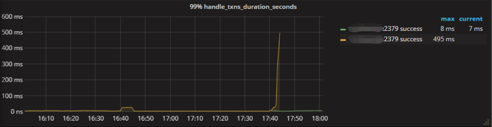
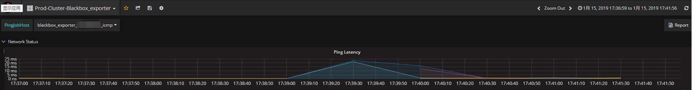
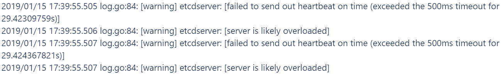

## 现象
接到告警，在1月15日下午17点40左右 PD leader 发生了切换，需要调查切换原因

## 环境信息收集
### 版本

v2.1.2

### 部署情况 

 - 三个 PD 节点，PD 与 TiDB 混合部署

## 分析步骤

- 查看 [PD - etcd 监控面板](https://pingcap.com/docs-cn/stable/reference/key-monitoring-metrics/pd-dashboard/#etcd)，原 leader 节点在该时间点处理 etcd 事务所需花费的时间（99% Handle transactions duration）异常上涨

- 查看 Blackbox_exporter 监控，原 leader 从 17:39 到 17:40 存在持续一分钟的 ping 延迟上涨及 metric 缺失

- 查看 PD leader 日志，发现该时间点 etcd 处理 raft 消息时压力比较大，导致心跳超时，所以其他两个 PD 节点重新发起了选举

## 结论
- 系统负载较高导致 PD 间心跳超时，尽量避免 PD 与其他服务混合部署