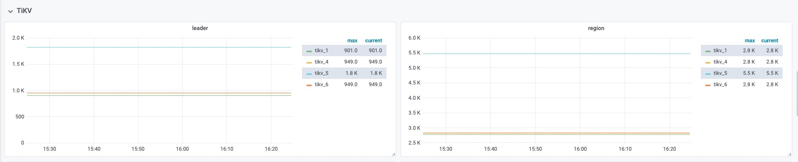
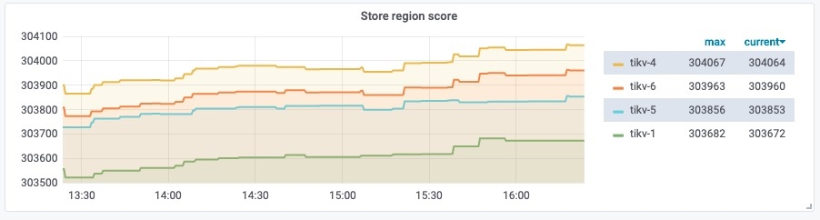

## 现象
- region 个数，以及 leader 个数，在不同机器上分布不均匀

## 环境信息收集
### 版本
- 3.0.0

### 部署情况
- 4 个 tikv，单机单实例部署

## 分析步骤
- 查看监控中 region/leader 的数量，发现并不均匀
- 查看各个 store 算出来的 region score，可以发现是差不多的，目前符合预期

 

## 处理建议
该结果符合预期，无需处理，因为 region 有的大有的小，而 TiDB 是尽量保证数据量差不多，如果让 region 个数一样的话就会导致空间不均衡了，所以会根据 region 的大小计算一个 score，调度会依据 score 以及 store 上数据的总大小。

## 结论
Region/leader 不均衡的情况，要首先看一下 region score 是否均衡，并不会按照 region/leader 个数做均衡。

