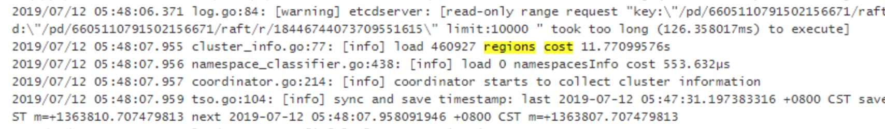

## 现象
- PD 出现异常切换，耗时 20 几秒，并出现大量 pd server timeout 报错，需要排查切换时间过长的原因。

## 环境信息收集
### 版本
- 2.1.13

### 部署情况
- pd tidb 混合部署
- 这是一个较大的集群，40 个 tikv
- region 数量 1383859（leader + follower）

## 分析步骤
- PD 切换时，会在新 PD leader 的 etcd 中加载所有的 region 列表。pd server timeout 原因可能是从 etcd 加载 region 列表耗时长，通过在 PD 日志中 grep "regions cost" 来看 load region 花费时间

- 从日志中看到 load 花费了 11s，这和 region 的数量是相关的，再加上 PD 节点宕机导致的重新选举确实在极端情况下确实要 10 多秒，总共耗时 20-30s 可以解释。

## 处理建议
3.0 开始为了解决 load region 耗时长的问题，使用 leveldb 代替 etcd 存储 region 信息。可以升级 3.0 并把 use-region-storage 设置为 true，这样加载 region 的速度降至秒级。

## 结论
PD 切换时需要加载所有的 region 列表，3.0 将 region 信息的存储方式从 etcd 改为 leveldb，加载速度会大大提升。

