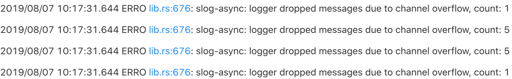
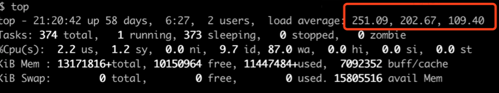
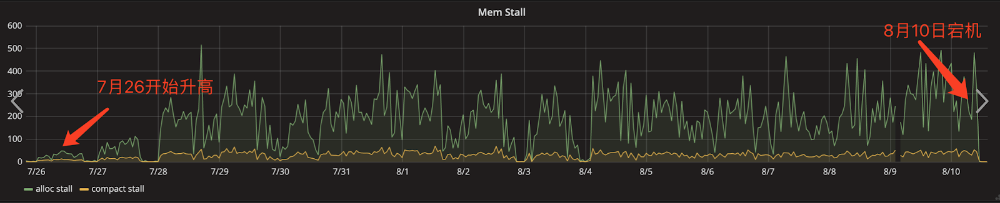
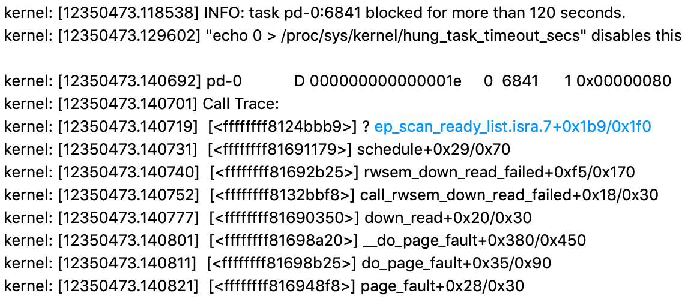
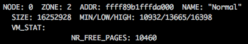
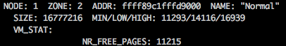

## 现象
内核频繁 Hang 住，TiKV 无法提供服务，强制重启机器后恢复

## 环境信息收集
### 版本
TiDB 版本: 2.1.6

OS/Kernel 版本: CentOS Linux release 7.6.1810/3.10.0-957.el7.x86_64

### 背景 

 - 出现 Hang 前两周在线关闭了系统的 THP ([Transparent Hugepage](https://www.kernel.org/doc/Documentation/vm/transhuge.txt) 的简写，是 Linux 内存管理系统中的一种优化特性，它通过使用较大的内存页面来降低大内存服务器环境下的 [TLB](https://en.wikipedia.org/wiki/Translation_lookaside_buffer) 查询开销)
 - 回滚 THP 配置之后 Hang 仍然出现

## 分析步骤

- TiKV 日志看到 Hang 期间存在很多 channel overflow 报错，TiKV 无法及时写入日志

- Hang 时查看 top 负载情况，Load 非常高，CPU 利用率不高，可能是内核层面卡住了

- 分析 Hang 前的系统监控和 dmesg 信息，dmesg 未发现异常，mem stall 和 alloc stall 持续升高，表现为内存压力过大 

- 通过 sar -B 可以看到 pscand/s 指标持续过高

- 从 kernel 的 call stack 信息看，内核在处理缺页异常时，发生了信号量死锁，且引发条件和 alloc stall 有关

- 开启 kdump 在 Hang 时生成 vmcore，分析 vmcore 查看系统内存每个 zone 的水位线信息，每个 node 中对应的 normal zone 的剩余内存都处于 min 水位线以下

## 结论
- 在持续的内存压力下，动态打开或关闭 THP 会触发大页小页之间的转换（页面迁移，内存压缩）等操作，导致内存碎片过多
- 在内存压力持续突破 min 水位线后，所有从 normal zone 申请内存的线程都要先参与内存直接回收才能从系统获取内存，系统的稳定性变差
- 根据磁盘 IO 的能力适当降低 dirty_ratio，避免积累大量脏页、减缓内存回收压力
- 在系统启动时就关闭 THP，或在线关闭 THP 后重启系统