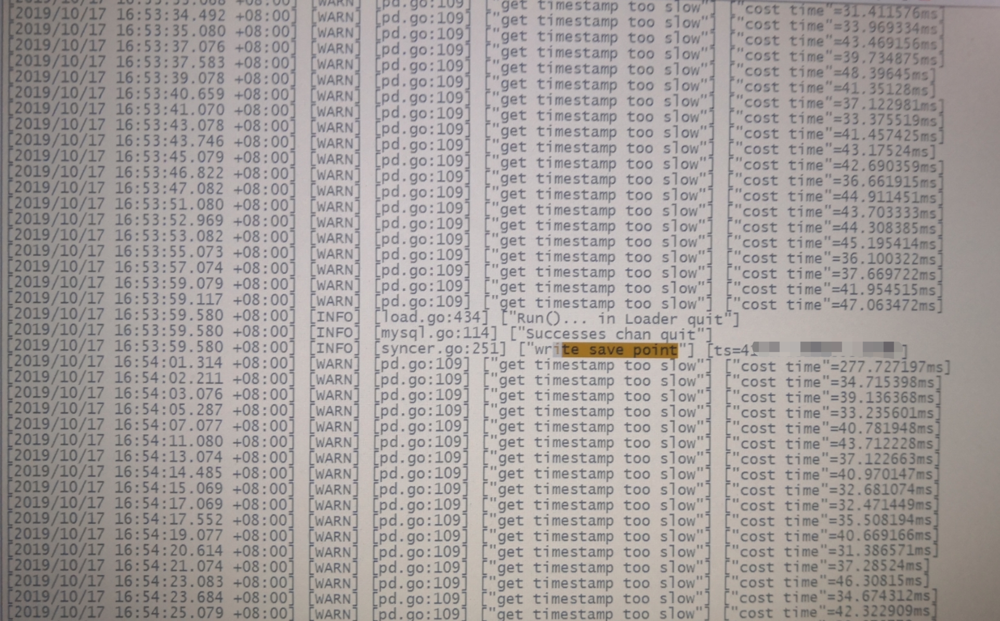

## 现象
Drainer 同步卡住，进程活跃但 checkpoint 不更新，日志中未见 error，有一处 “Run () in loader quit success chan quit” 信息

## 环境信息收集
### 版本
drainer 版本：3.0.3

## 分析步骤
- 查看 drainer 日志，最后一次记录 savepoint 信息后，后面的日志中全部是 get timestamp too low 日志

- curl http://drainer-ip:port/debug/pprof/goroutine?debug=2 

- 查看相关 [pr](https://github.com/pingcap/tidb-binlog/pull/749) 已知问题，已在 3.0.4 上修复

## 结论

- Drainer 同步卡住，进程活跃但 checkpoint 不更新该问题为已知 bug，已在 3.0.4 上修复。如遇类似问题，可升级到 3.0.4 版本。
