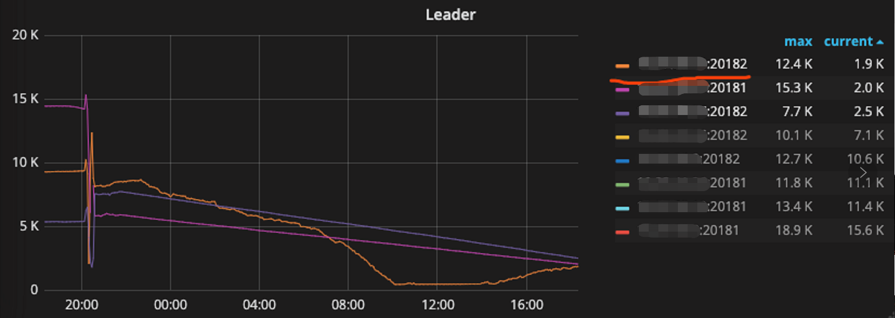
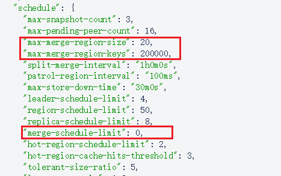

## 现象
对一台机器上的两个 TiKV (store 532703 和 store 532704) 执行缩容后，另一个 TiKV (store 8) 上的 leader 不断调出，持续约 12h，leader count 从 8000+ 降到 400+

## 环境信息收集
### 版本
v2.1.16

### 部署情况 

 - 同机房部署，4 台 TiKV 机器，单机两实例，TiKV 与 PD 均已配置 host label

## 分析步骤

- [pd-ctl](https://pingcap.com/docs-cn/stable/reference/tools/pd-control/) 检查 `region topsize` 输出，少数几个 region 的 approximate_size 200MB+，检查排在前几位的 region ，没有分布在 store 8 上的
- 导出 region 用 jq 命令统计 approximate_size 小于 2MB 的 region，存在大量小 region
	> pd-ctl -d region | jq ".regions | map(select(.approximate_size < 2 )) | length"

- `config show all` 查看 region merge 相关参数，merge-schedule-limit 为 0，没有打开 merge 

- 查看 pd 日志，`grep 'to store 8' pd.log` 过滤 transfer 到 store 8 上的 region，抽样检查这些 region，未发现比较大的 region，如果存在一个大的 region 可能会影响一批小 region 的 leader 调度

## 结论
- 当前版本 PD 是根据 region size 进行 leader 调度的，由于集群中存在大量空 region 和小 region，且没有开启 merge，在下线过程中一个迁移较大 region 的操作可能会导致某个 store 上的 leader score 发生变化
- 建议打开 region merge，可以改善 region 和 leader 分布不均衡的情况
