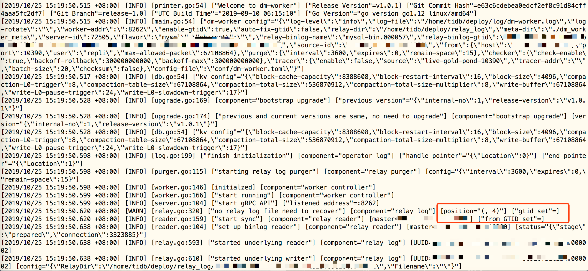

## 现象

部署 DM，初始状态未配置 relay_binlog_gtid，报错 ERROR 1236 (HY000): The slave is connecting using CHANGE MASTER TO MASTER_AUTO_POSITION = 1, but the master has purged binary logs containing GTIDs that th e slave requires.添加 relay_binlog_gtid 并重新部署，滚动更新后，仍报错。

## 环境信息收集
### 版本
tidb:3.0.4

dm:v1.0.1

## 分析步骤
- 查看 dm-worker 日志，分析具体原因

## 解决方案
- 1.停止 dm-worker 进程
- 2.手动删除 relay_binlog
- 3.启动 dm-worker 进程则同步正常

## 结论
- DM-worker 进程在退出时、以及定时（30s）会把内存中的 gtid 信息保存到 relay.meta 中，在没有获取到上游 GTID 信息的情况下，把空的 GTID 信息保存到了 relay.meta 中。
- DM-ansible 不会执行删除 relay_binlog 目录的操作（需要手动执行），因此滚动更新后，relay_meta 中仍然是记录的空的 GTID 信息，因此该错误仍然会出现。
- 1.0.2 版本之后，在没有手动指定 relay_binlog_gtid 时，DM 会自动使用当前时刻上游最新的 GTID（SHOW MASTER STATUS 返回的信息）。