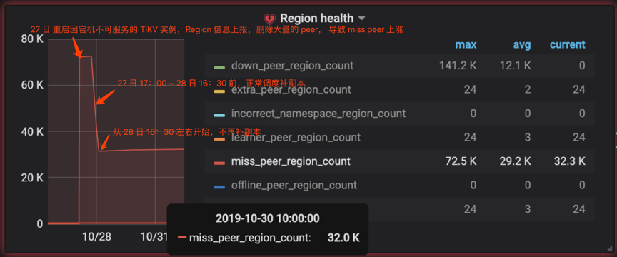
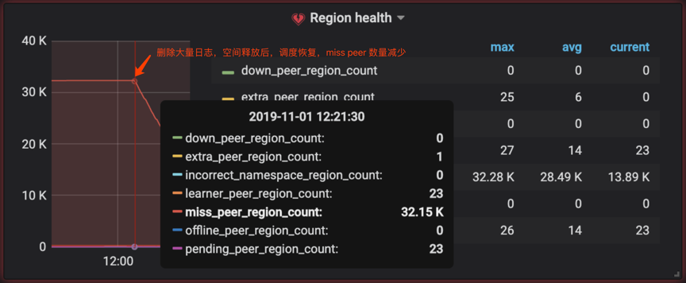

## 现象

* 故障持续时间：2019 年 10 月 25 日 ~ 11 月 1 日

* 故障详情：

  1. 10 月 25 日 出现机器宕机现象，其上的 4 个 TiKV 实例终止服务。
  2. 10 月 27 日 发现服务器宕机，将服务器重新拉起，此时距离 TiKV 实例宕机时间已经超过 30 分钟。重新拉起之后，到 28 日 16：30 之前，从监控可见进行了一段时间的补副本的操作。
  3. 10 月 28 日 16：30 左右开始，不再补副本，同时 PD 监控面板 Cluster --> Region health--> Miss peer 的数量在增加。

    

## 环境信息收集

* 版本

  3.0.3

* 部署情况
  
  * 部署方式：ansible 部署
  * 实例数量：TiKV 40 个实例

## 分析步骤

### 统计缺少副本 的 region 信息

  ```sh
  region --jq=".regions[] | {id: .id, peer_stores: [.peers[].store_id] | select(length != 3)}"
  ```

  结果显示有 3w+ Region 缺失一个 peer。

### 排查 PD 不调度的原因

1. 查看 PD 监控面板调度相关的监控

    ```log
    # 检查新 operator 的创建数量
    Operator --> Schedule operator create

    # 检查已完成调度的 operator 的数量
    Operator --> Schedule operator finish

    # balance-region scheduler 的状态
    Scheduler --> Balance Region scheduler

    # Store 被选作调度 target 或 source 的次数
    Scheduler --> Balance Direction
    ```

2. 检查 store label 的设置  

    检查各个 TiKV 节点的 label 的配置，排查因 label 设置不正确而出现的调度异常的情况。

    ```sh
    pd-ctl store
    ```

3. 检查调度相关的参数设置

    检查下调度相关的参数设置是否正确且值不为 0 ，region-scheduler-limit、max-snapshot-count 等。

    ```sh
    pd-ctl config show
    ```

    尝试调大相关参数后，Miss Peer 数量无明显下降，仍未自动补副本。

4. 检查下当前环境中的调度器是否启用

    ```sh
    pd-ctl scheduler show
    pd-ctl operator show
    ```

    当前环境中调度器运行正常。

5. 先获取下补副本的目标 Region 的信息,并记录：

    ```sh
    # 获取 Region ID 为 1 的 Region 的信息
    pd-ctl region 1
    ```

    对目标 Region 手动补充副本

    ```sh
    # 在 store 2 上新增 Region 1 的一个副本
    pd-ctl operator add add-peer 1 2
    ```

    再次查看手动补充副本的目标 Region 的信息，该 Region 通过手动的方式完成补充副本的动作：

    ```sh
    pd-ctl region 1
    ```

    以上确认，手动补充副本的动作可以正常完成。

6. 问题小结

    1）label 设置正确
    2）PD 调度参数正常
    3）PD 调度器运行正常
    4）手动可以完成补副本动作

7. 排查下是否因 store 剩余空间不足，导致 PD 调度异常

   * 检查下 PD high-space-ratio，以及 low-space-ratio 的设置情况，并记录：

      ```sh
      pd-ctl config show
      ```

      该环境中 high-space-ratio 以及 low-space-ratio 分别使用默认值 0.6，0.8，即剩余可用空间分别为 40%，20%，该参数会影响 PD 调度算法的选择。

   * 查看下各个 store 节点的空间使用情况, 可以通过下面的方式确认：

      ```log
      TiKV-Detais 监控面板 Cluster --> Store size / Available size / Capacity size，确认下 store 剩余空间

      或

      登陆到 store 节点的操作系统层确认下磁盘的剩余空间
      ```

      在 TiDB 中如果 store 节点的剩余空间小于 20%，则 PD 会因为 store 的剩余空间不足而停止自动调度，但是不影响手动调度的正常执行。

      通过上述方式，确认需要补充副本的 store 节点的剩余空间为 10% 左右，小于 PD 定义的 low-space-ratio 的默认设置 20% ，最终导致 PD 停止自动掉度，并且监控上的表现为 Miss Peer 一直持续保持不变。

## 结论

* 需要补充副本的 store 节点的剩余空间为 10% 左右，小于 PD 定义的 low-space-ratio 的默认设置 20% ，最终导致 PD 停止向剩余空间小于 20% 的节点自动调度，并且监控上的表现为 Miss Peer 一直持续保持不变。

* 通过排查，确定是因为在机器挂掉期间，其他 TiKV 节点产生了大量报错日志，堆积在对应的服务器上，大概占用存储空间 10% 左右，导致服务器整体空间利用率飙高，可用空间小于 10%。

* 用户删除服务器堆积的大量无用日志之后，空间释放，开始自动补副本。

  
