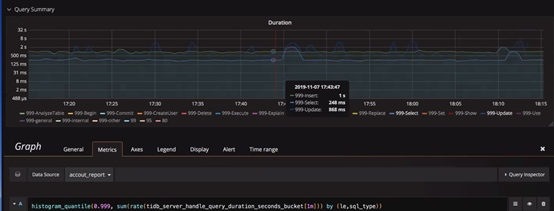
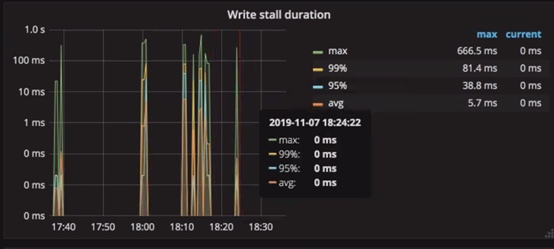

## 现象
- 读写业务均要求超时时间为100ms，当前读写业务全天经常阶段性超时

## 环境信息收集
### 版本
- 2.1.4

### 部署情况
 - 20个 tikv 实例分布在5台服务器上

## 分析步骤
- 观察到业务的 duration 确实出现增高 

- 可以发现是一个很常见的问题：rocksdb 的 write stall 限流，他有 2 个原因，具体是哪种原因导致的，需要看 rocksdb 的日志，参考指令：grep "Stalling" LOG | more：

    - Level0 的 sst 文件过多，这是最常见的原因。因为 level0 的 sst 太多会导致 RocksDB 的读放大上升，所以此时 rocksdb 会根据 sst 的个数做不同的限流措施，它通常有 3 个参数控制：
        - level0-file-num-compaction-trigger：当 level0 的 sst 文件个数达到该值触发 compaction
        - level0-slowdown-writes-trigger：当 level0 的 sst 文件个数到达该值，RocksDB 会尝试减慢写入的速度。
        - level0-stop-writes-trigger：当 level0 的 sst 文件个数到达该值，RocksDB 会禁止写入速
    - Compaction 的速度跟不上，一直积压，导致需要 compation 的量超过限制，也会触发限流
        - 如果超过 soft-pending-compaction-bytes-limit 默认 64G 需要 compaction，那写入率会降低
        - 如果超过 hard-pending-compaction-bytes-limit 默认 256G 需要 compaction，则会禁止写入

## 处理建议
由前面分析可以知道，这是由于 rocksdb 的写入到达瓶颈，需要根据机器性能，加快 compaction 速度

- 调整 rocksdb 参数 max-sub-compactions 至 2~3，可以将 level0 到 level1 的 compaction 拆分为多个子任务，并行 compaction 加快速度
- 适当调大 level0-slowdown-writes-trigger = 40，level0-stop-writes-trigger = 56，但这不一定能解决问题，只是加大了限制进行缓解
- 扩容 TiKV，这是一个直接的办法，将写入分摊到更多的 TiKV 上

## 结论
当业务请求出现请求超时的情况，可以通过排查 write stall 监控，看是否 rocksdb 出现了流控是一个非常直接的做法。

