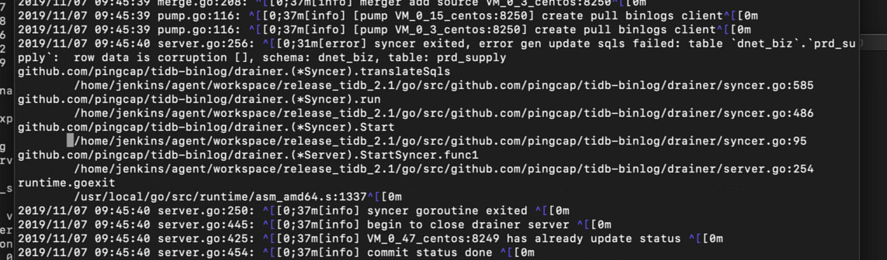

## 现象
* 从集群同步到 TiDB Drainer异常中断

## 问题分析
* 已知信息

>版本 V2.1.8，在出现 drainer 异常中断后，尝试更改下游checkpoint 表中 commit ts + 1 无效，错误仍然相同，日志中看到信息已更改



* 分析步骤
	* 查看表结构
	
	```
	CREATE TABLE `prd_supply` (

  `sid` varchar(24) NOT NULL,

  `inway` tinyint(4) NOT NULL,

  `plat` tinyint(4) NOT NULL,

  `offer` varchar(24) NOT NULL,

  `pid` varchar(24) NOT NULL,

  `bid` int(11) NOT NULL,

  `mid` int(11) NOT NULL,

  `pname` varchar(256) NOT NULL,

  `level` int(11) DEFAULT NULL,

  `mdram` int(11) NOT NULL,

  `mdnet` int(11) NOT NULL,

  `mdcolor` int(11) NOT NULL,

  `mdofsale` int(11) NOT NULL,

  `mdwarr` int(11) NOT NULL,

  `pcost` decimal(11,2) NOT NULL,

  `cost11` decimal(11,2) NOT NULL DEFAULT '0',

  `cost12` decimal(11,2) NOT NULL DEFAULT '0',

  `cost13` decimal(11,2) NOT NULL DEFAULT '0',

  `cost14` decimal(11,2) NOT NULL DEFAULT '0',

  `cost21` decimal(11,2) NOT NULL DEFAULT '0',

  `cost22` decimal(11,2) NOT NULL DEFAULT '0',

  `cost23` decimal(11,2) NOT NULL DEFAULT '0',

  `cost24` decimal(11,2) NOT NULL DEFAULT '0',

  `cost31` decimal(11,2) NOT NULL DEFAULT '0',

  `cost32` decimal(11,2) NOT NULL DEFAULT '0',

  `ryccost` decimal(11,2) NOT NULL DEFAULT '0',

  `salecost` decimal(11,2) NOT NULL DEFAULT '0',

  `prdcost` decimal(11,2) NOT NULL DEFAULT '0',

  `costuptime` int(11) NOT NULL DEFAULT '0',

  `imgsrc` varchar(50) NOT NULL,

  `imgpack` varchar(5120) NOT NULL,

  `salestat` tinyint(4) NOT NULL,

  `salechn` tinyint(4) NOT NULL DEFAULT '0',

  `saleway` tinyint(4) NOT NULL,

  `saleamt` decimal(11,2) NOT NULL,

  `salecmm` decimal(11,2) NOT NULL DEFAULT '0.00',

  `saleprvid` int(11) NOT NULL,

  `salecityid` int(11) NOT NULL,

  `saleareaid` int(11) NOT NULL,

  `saletime` int(11) NOT NULL,

  `cmmamt` decimal(11,2) NOT NULL DEFAULT '0',

  `profit` decimal(11,2) NOT NULL DEFAULT '0',

  `atime` int(11) NOT NULL,

  PRIMARY KEY (`sid`),

  KEY `idx1` (`offer`),

  KEY `idx2` (`pid`),

  KEY `idx6` (`plat`),

  KEY `idx7` (`mid`,`salestat`,`saletime`),

  KEY `idx8` (`mid`,`salestat`,`mdram`,`saletime`),

  KEY `idx9` (`mid`,`salestat`,`mdofsale`,`saletime`),

  KEY `idx10` (`mid`,`salestat`,`mdnet`,`saletime`),

  KEY `idx3` (`mid`),

  KEY `idx4` (`plat`,`inway`,`saletime`)

   ) ENGINE=InnoDB DEFAULT CHARSET=utf8mb4 COLLATE=utf8mb4_bin;

	```	
	
	* 排除是 generated column 有关的错误：

	>* 相关表格没有用到 generated column
	>* 升级到包含 generated column [bugfix](https://github.com/pingcap/tidb-binlog/pull/515) 的 2.1.18 依然报错

	* 进一步分析：

  >* 确定出现图中 gen update sqls failed 错误的 binlog 的 start ts
  >* 通过 HTTP debug 接口查出对应 Binlog 的 prewrite value
  >* 在本地搭建测试环境，用表格定义生成 TableInfo
  >* 解析 prewrite value，用 TableInfo 调用 genUpdateRows 
  
  * 在 v2.1.18 基础上加了几个日志，记录 drainer 在 binlog translate 出错时对应的 ts
  
     

 * 从日志中得到的主要信息：

 >* 出错的 binlog ts 是 412363454584717447
>* 出错的直接原因是 DecodeOldAndNewRow 里解析 row 之后发现比 tableInfo 里的少一列
>* 少掉的一列信息如下
  
  ``` 
	{{[{u'default_bit': None, u'comment': u'', u'name':
	{u'L': u'cmmamt', u'O': u'cmmamt'}, u'default': u'0', u'dependences': None, u'generated_stored': False, u'generated_expr_string': u'', u'state': 5, u'version': 2, u'offset': 40, u'type': {u'Decimal': 2, u'Charset': u'binary', u'Elems': None, u'Tp': 246, u'Flag': 1, u'Collate': u'binary', u'Flen': 11}, u'id': 50, u'origin_default': u'0'}] }}
  ```
 
* 从现象跟目前信息猜测可能为
	
	> delete column 状态改变：public -> write-only -> delete-only -> None 状态改成 None 的时候写binlog, 大概率是在 delete-only 阶段没写 delete 这行的数据

	* 出错 binlog 的 ts 对应自然时间 2019-11-06 20:02:22，跟提供的 DDL 日志里删除 cmmamt 列的时间非常接近
	
	```
	tidb-2019-11-07T15-52-12.246.log:[2019/11/06 20:02:22.553 +08:00] [INFO] [ddl.go:498] ["[ddl] start DDL job"] [job="ID:10323, Type:drop column, State:none, SchemaState:none, SchemaID:39, TableID:4255, RowCount:0, ArgLen:1, start time: 2019-11-06 20:02:22.498 +0800 CST, Err:<nil>, ErrCount:0, SnapshotVersion:0"] [query="ALTER TABLE `prd_supply` DROP `cmmamt`"]
	```
	
* 问题原因

	* 异常中断是因为 Drainer 尝试检查行数据完整性时缺少足够的信息，为了避免下游数据损坏而中断同步。这种异常状态的影响范围是有限的，只会影响一个表在 drop column 执行一段时间内的 update Binlog。可通过一下特征来判断
	
>* 出错的 DML 包含 Update 改动 
>* 上游在 DML 相近的时间点内执行过 Drop column
>* 出错时 Binlog 里的列比 TableInfo 里的少


## 解决问题
* 使用 [hotfix](https://github.com/pingcap/tidb-binlog/tree/col-missing-hotfix)  版本即可解决，已合到 master 版本
