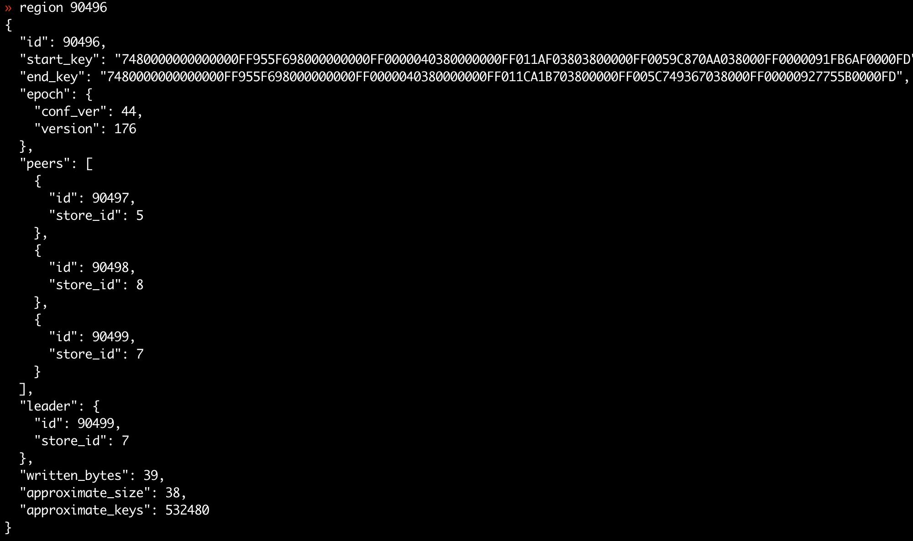
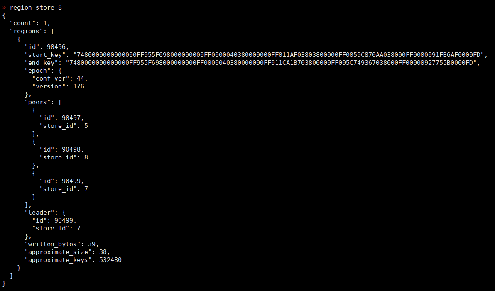
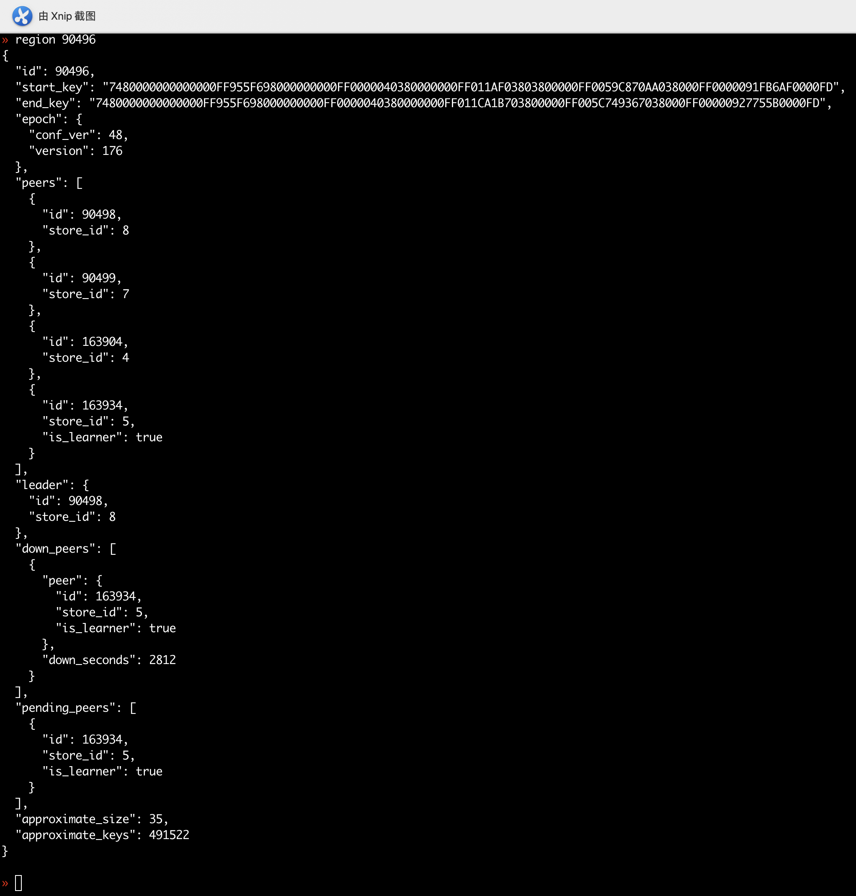
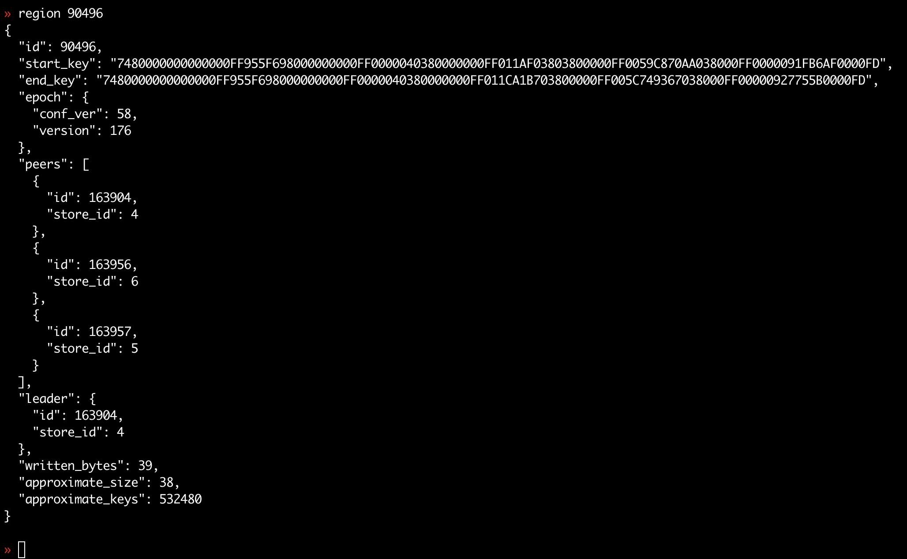

## 现象

- TiKV 缩容的时候，最后一个 region 迁移不走。通过 tikv-ctl 将对应的 region [设置为 tombstone](https://pingcap.com/docs-cn/stable/reference/tools/tikv-control/#%E8%AE%BE%E7%BD%AE%E4%B8%80%E4%B8%AA-region-%E4%B8%BA-tombstone)。

- 执行操作报错结果

```log
thread 'main' panicked at 'called `Result::unwrap()` on an `Err` value: "IO error: While lock file: **/db/LOCK: Resource temporarily unavailable"', libcore/result.rs:945:5
```

- 确认是由于 TiKV Server 没有停掉导致执行失败，停掉 TiKV Server 后，执行 tikv-ctl 设置 region 为 tombstone 拨错如果如下：

- 通过 PD control 查看 store 7 的状态


- 通过 TiKV control 执行 region tombstone 操作报错。

```log
region: 90496, error: StringError("[src/server/debug.rs:944]: invalid conf_ver")

```

- region 的 信息



- 启动 TiKV Server，通过 PD Control 执行 Remove-peer 操作，将该 TiKV Server 上的 Region peer 删除操作,发生报错。

```shell
» operator add remove-peer 90496 7
[500]:"failed to add operator, maybe already have one"
```

- 再通过 PD control 的 Operator Remove 命令删除操作，重新执行 Remove-peer 操作，依然报错。PD 日志中看到 Operator 操作超时。

```log
 {"log":"[2019/11/19 17:28:00.699 +08:00] [INFO] [operator_controller.go:107] [\"operator timeout\"] [region-id=90496] [operator=\"\\\"admin-remove-peer (kind:leader,region,admin, region:90496(176,44), createAt:2019-11-19 17:17:59.44      7586381 +0800 CST m=+6235173.661552827, startAt:2019-11-19 17:17:59.447747301 +0800 CST m=+6235173.661713720, currentStep:0, steps:[transfer leader from store 7 to store 5 remove peer on store 7]) timeout\\\"\"]\n","stream":"stdout"      ,"time":"2019-11-19T09:28:00.700010434Z"}
```

- 目前需要排查 Remove-peer 失败原因和提供处置办法。

## 环境信息收集

缩容的 TIKV Server store id 7 ，紧接着又缩容 TiKV Server store id 8，相当于将 Region ID 90496 的 2 个 peer 被下线。

- store 8 状态
  


- store 8 上的 region 情况



### 版本： v3.0.2

### 分析步骤

1. 通过 PD control 检查 Region id 90496 情况，在 storei id 为 leader 8、peer 7、4，learner 5



2. 通过对应的 store TiKV 日志报错

```log
{"log":"[2019/11/19 20:00:08.999 +08:00] [INFO] [process.rs:179] [\"get snapshot failed\"] [err=\"Request(message: \\\"EpochNotMatch current epoch of region 90496 is conf_ver: 44 version: 174, but you sent conf_ver: 44 version: 176\\\" epoch_not_match { current_regions { id: 90496 start_key: 7480000000000000FF955F698000000000FF0000040380000000FF011AF03803800000FF0059C870AA038000FF0000091FB6AF0000FD end_key: 7480000000000000FF955F698000000000FF0000040380000000FF011C1D8E03800000FF0059F0F355038000FF000009247E460000FD region_epoch { conf_ver: 44 version: 174 } peers { id: 90497 store_id: 5 } peers { id: 90498 store_id: 8 } peers { id: 90499 store_id: 7 } } current_regions { id: 90433 start_key: 7480000000000000FF955F698000000000FF0000040380000000FF0119988B03800000FF005BC6258D038000FF00000918DAEE0000FD end_key: 7480000000000000FF955F698000000000FF0000040380000000FF011AF03803800000FF0059C870AA038000FF0000091FB6AF0000FD region_epoch { conf_ver: 53 version: 173 } peers { id: 90434 store_id: 5 } peers { id: 138440 store_id: 6 } peers { id: 152726 store_id: 4 } } })\"] [cid=18993540]\n","stream":"stderr","time":"2019-11-19T12:00:08.999923845Z"}
```

### 结论

- 从日志中发现 region 90496 的 leader 在 store id 5 上，region epoch 为：{44, 174}，follower 为 store 7/8。但是 pd 上 region epoch为 {44, 176} 比 store 5 新，导致 region 信息一直未更新，仍认为 store 7 是 leader，所以 transfer region 一直失败。问题触发原因试音为 Region Merge bug 引起的，已经在 v3.0.5 修复 https://github.com/tikv/tikv/pull/5512 。
  
- 方法一： 用户可以直接升级到 v3.0.5,来解决问题。
- 方法二： 将 store id 5 的 TiKV Server 停掉一段时间，触发 Region id 90496 重新选注，选主后重新启动 Store id 5  的 TiKV Server 。通过 PD control 的 remove-peer 操作移动走 store id 5 上对应的 peer，然后 Region id 90496 会自己补副本。如果 remove-peer 操作 region 设置为 tombstone ，region 还是无法从 store id 7、8 的 TiKV Server 移走，通过 transfer-region 将 region id 90496 强制迁移到其他的 TiKV Server 下。这样 store id 7、8 会 offline 成功，变成 tombsotone 状态。


