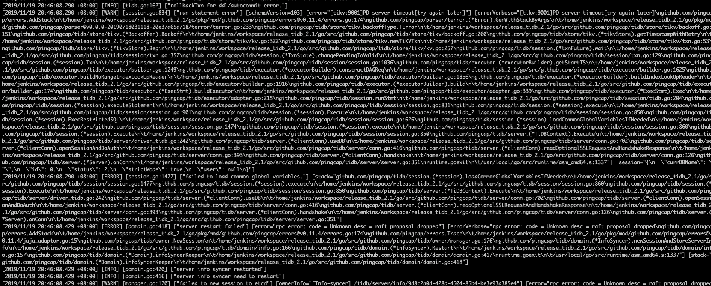
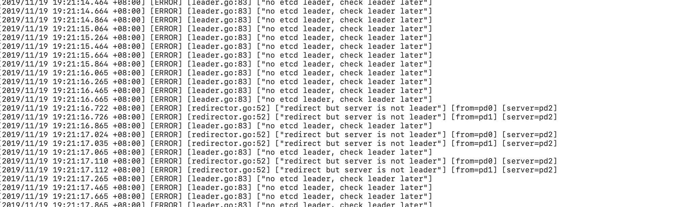
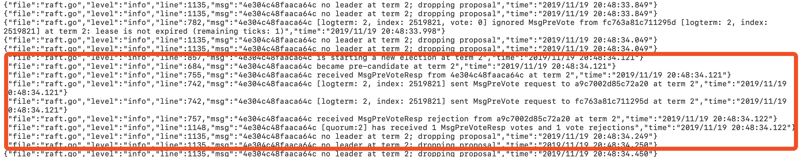
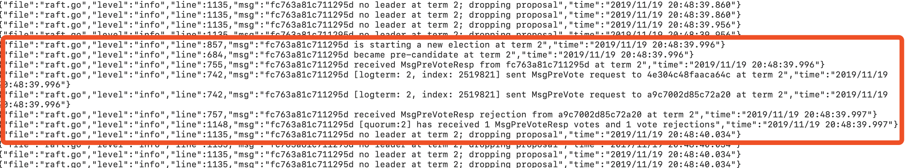

## 现象
* TiDB 日志

 
* TiKV 报错

 ```
 check cluster bootstrapped failed
 ```
 
* PD leader 日志 

 

## 问题分析
* 已知信息

>
版本 2.1.17，三个 PD，在 19:20-19:21 有网络抖动，之后出现 no etcd leader 信息，集群报错。集群服务异常之前，PD2(a9c7002d85c72a20) 为旧 leader，PD1 (4e304c48faaca64c) 和 PD0（fc763a81c711295d) 为 follower
>

* 分析步骤
	* PD1 日志

     
     
    * PD0 日志
    
      
    
>
>分析日志可以看到，在异常期间，不断在 term 2 发起选举又一直没有选出 leader，其中 PD1 和 PD0 分别与 PD2 一直在进行选举，同时也拒绝对方，一直没有选出 leader
>

* 问题原因

>在低版本中，etcd 存在 bug，prevote 没有重新设置 random election timeout， 造成两个 PD 一直在选举，同时也拒绝对方，无法选出 leader 节点
>

## 解决办法
>
>通过重启 PD 集群所有节点可恢复。在 2.1.19 版本开始对该 bug 进行了修复，可考虑升级集群版本
