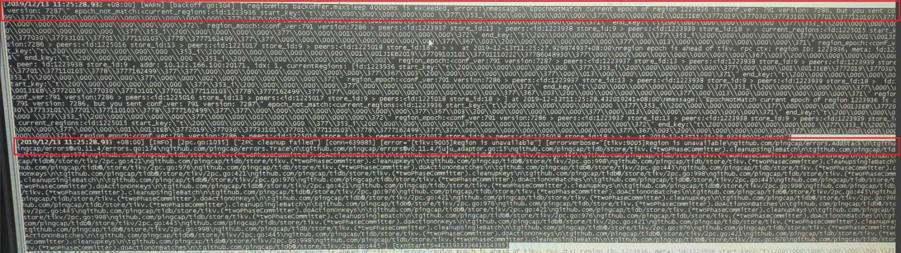
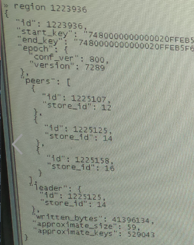
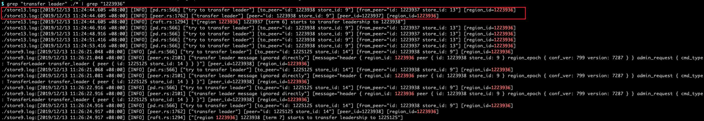
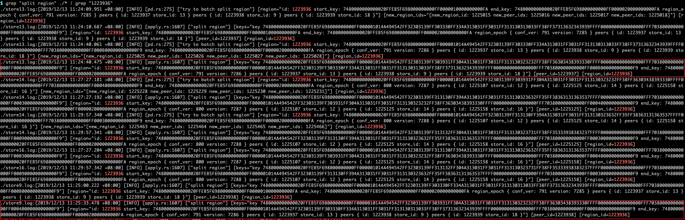
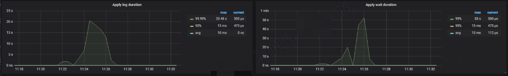

## 现象
跑批任务执行 insert 语句的时候报错，应用侧日志报 `org.springframework.transaction.TransactionSystemException:Could not commit JDBC transaction;nested exception is java.sql.SQLException:Region is unavailable`

## 环境信息收集
### 版本

v3.0.5

## 分析步骤

1. 首先看下 tidb.log 日志中是否有异常信息

从第一行错误信息 `regionMiss backoffer.maxSleep 4000ms is exceeded,errors:\nmessage:\"EpochNotMatch current epoch of region 1223936 is conf_ver:791 version: 7286,but you sent conf_ver:xxx version:7287" ······ region epoch is ahead of tikv` 看到在访问 region 1223936 的时候，请求的 epoch 版本是7287，但是实际 tikv 上的 region 的 epoch 版本是 7286，导致 tidb 进行 backoff 重试，达到了 backoff 重试的最大超时时间，所以报错了

第二行错误信息 `[error="[tikv:9005]Region is unavailable"]` 看到了提示的 region is uavailable 错误信息。

从 tidb.log 中可以看到是 region 1223936 出现了问题。

2. 通过 pd-ctl 检查 region 1223936 的状态

通过 pd-ctl 检查 region 1223936 的状态，看起来状态是正常的，且看 epoch 版本是 7289 也比日志中请求的版本号大，理论上可以正常访问的。说明是当时时刻这个 region 的状态不正常。

第一步中查看 tidb.log 看到 `region epoch is ahead of tikv` 这个错误通常是因为 region 发生了 split/merge 之后，tidb region cache 中记录的 region epoch 过期，因此第一次访问的时候会返回 epoch not match 的信息，tidb 在接收到 epoch not match 的信息之后，再次向 tikv 发送请求（tikv 在返回 epoch not match 信息的同时会返回对应 region 的最新信息），但是这时 region 切换了 leader ，且新的 leader 还未执行 split/merge 的操作，所以出现了 `region epoch is ahead of tikv` 日志。

3. 查看 tikv.log 中关于 region 1223936 的信息，确认 region epoch is ahead of tikv 的原因

根据 `transfer leader` 关键字在所有 tikv 节点日志中过滤看到 region 1223936 是在 11:24:44 的时候从 store13 上 transfer leader 到了 store9。

根据 `split region` 关键字在所有 tikv 节点日志中过滤看到 region 1223936 在 store13 节点上是 11:24:40 开始 split 操作，在 store9 上直到 11:25:33 才执行 split 操作。tidb 日志中是在 11:25:28 的时候报的 `region epoch is ahead of tikv` 错误，当时 region 1223936 的 leader 已经从 store13 切换到了 store9 上，但是 store9 上还没有执行 store13 上执行过的 split 操作，导致 epoch 版本匹配。

通过日志时间计算可以推断，store9 比 store13 apply 慢了约 53s，下一步可以排查一下 apply 慢的原因。

4. 查看 apply 线程相关监控 TiKV-Detail -> Raft IO

可以看到 Apply log duration 和 Apply wait duration 当时都很高，基本可以确定是由于 apply 慢导致 region 1223936 的 split 操作没有及时同步到新 leader 节点上，且时长超过重试最大超时时间后，返回给应用 Region is unavailable 错误。

关于 apply 慢的原因排查可以参考性能地图中，apply 慢导致 TiKV 写入慢的步骤进行排查。

## 结论
- region 进行 split/merge 操作之后，发生 leader 切换，且由于 follower apply 应用比较慢，导致 split/merge 操作没有及时同步过来，tidb 访问 tikv 的region 时，由于 split/merge 操作没有同步，所以 region 的 epoch 版本不正确，进行重试，达到最大超时时间，返回给应用 `Region is unavailable` 的错误。

## 补充知识点

* 关于 TiDB 中常见的 backoff 超时时间定义在：https://github.com/pingcap/tidb/blob/master/store/tikv/backoff.go#L139 , NewBackoffFn 函数第二个参数就是表示单次最大超时时间

* TiDB 在 3.0 中新增了 `tidb_back_off_weight` (在 v3.0.3 及之后版本是 `tidb_backoff_weight`) 变量，用于控制 TiDB 最大 backoff 时间的权重。比如代码中定义的 backoff 最大超时时间为 N，`tidb_backoff_weight` 设置为了 2（默认值），那么最大的超时时间为 2N。

* 3.0 中 https://github.com/pingcap/tidb/pull/10266 这个 pr 默认关闭重试后增加了重试 weight 系数，默认是 2 。

