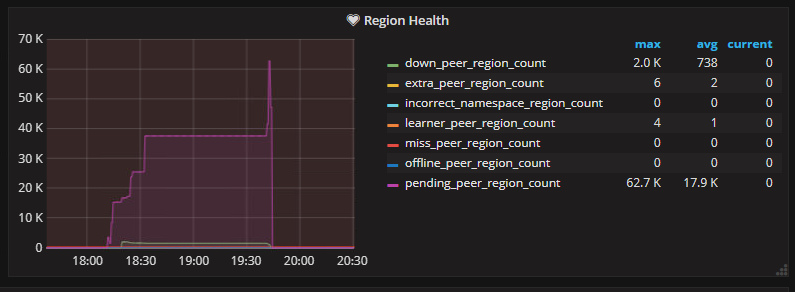
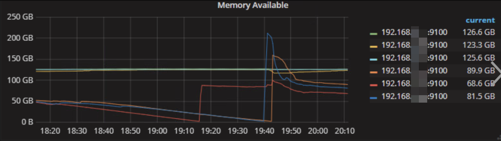
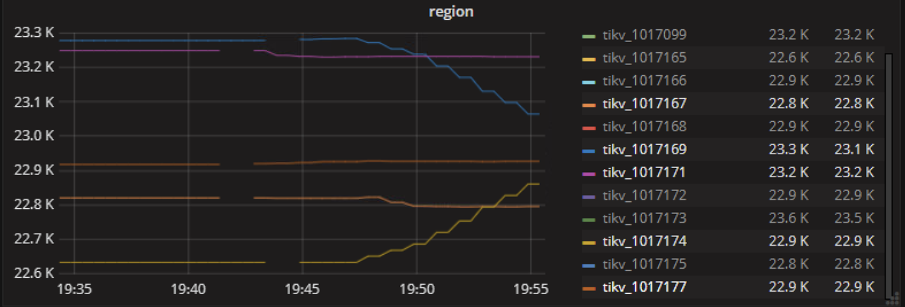

## 现象
12月23号 18:10-19:45 之间集群不可用，通过监控看到集群 duration 很高，达到分钟级别，客户端访问 TiDB 集群，报 `region is unavailable` 错误。

## 环境信息收集
### 版本

v2.1.14

### 部署情况

 - tidb-ansible 部署方式部署，三台物理机，每台物理机四个 TiKV 实例
 - 用户说 TiKV cluster 与 PD 均已配置 label

## 分析步骤

1. 首先检查 region 状态，查看 Overview -> PD -> Region Healthy 监控项发现故障时间段有大量 pending_peer_region_count 以及部分 down_peer_region_count

Pending 和 Down 是 Peer 可能出现的两种特殊状态。其中 Pending 表示 Follower 或 Learner 的 raft log 与 Leader 有较大差距，Pending 状态的 Follower 无法被选举成 Leader。Down 是指 Leader 长时间没有收到对应 Peer 的消息，通常意味着对应节点发生了宕机或者网络隔离。

怀疑当时 tikv 节点发生了重启。

2. 排查是否是因为 oom 导致 tikv 节点重启，查看 Overview -> System Info -> Memory Available 监控项发现有有三台物理机的可用内存存在掉底的情况

要确认是否是由于 oom 导致重启，可以 `grep -i "out of memory /var/log/messages"` 查看是否可以匹配到关键字内容来确认。

经确认 tikv 节点是发生过 oom。

3. 在多副本（副本数 3 及 3 以上）且设置了 label 的情况下，正常不会将一个 region 的多数副本调度到同一个物理机上，如果一个物理机发生宕机不会影响集群使用，因为仍能保证 raft 多数派协议。但如果多台物理机同时故障，仍然会影响集群。通过查看 Overview -> TiKV -> region 监控项发现存在不同物理机上的 tikv 实例同时因为 oom 重启

其中 tikv_101167,tikv_1017171,tikv_1017174 在同一台物理机上， tikv_1017169,tikv_1017177 在同一台物理机上，它们同时发生了 oom 重启，导致即使在配置了 label 的情况下也发生了部分 region 无法服务的情况。

要确认更加具体的时间可以通过 tikv.log 日志确认，`grep "Welcome"` 到 `grep "TiKV is ready to serve"` 可以确认每个 tikv 启动的耗时以及什么时候开始对外提供服务，根据日志可以更准确确认是否存在不同物理机上 tikv 实例同时不可用。

## 结论
- 虽然 TiKV 正确配置了 label，但是短时间内多台物理机的多个 tikv 实例发生 oom 重启导致了服务不可用。

